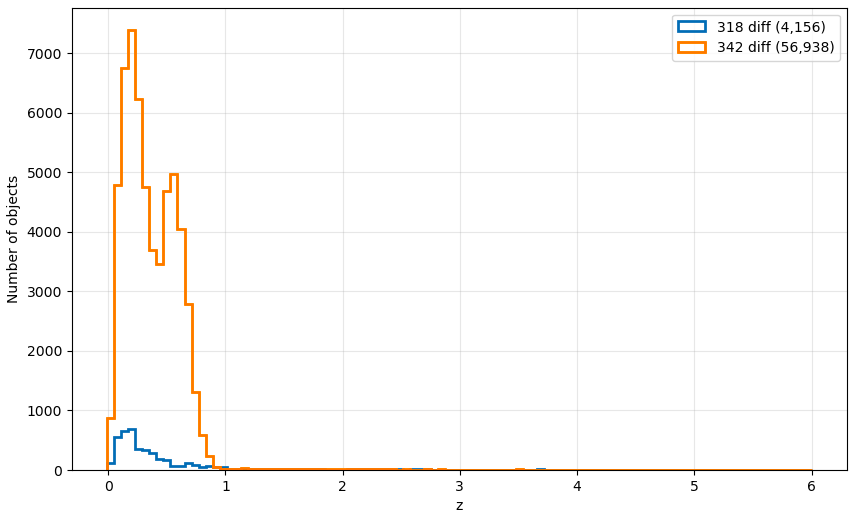
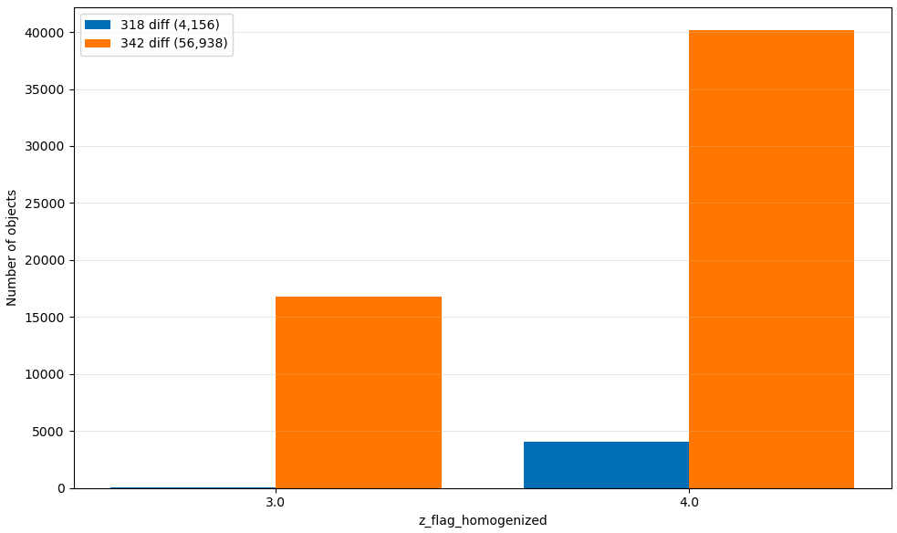
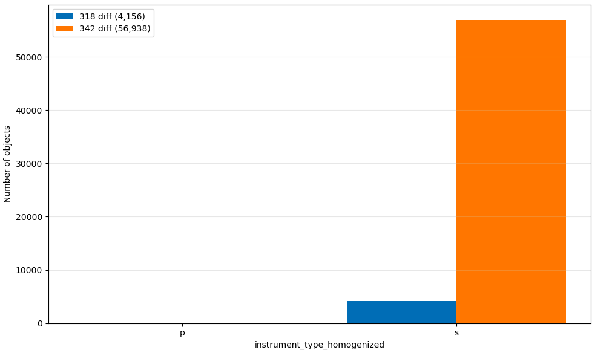
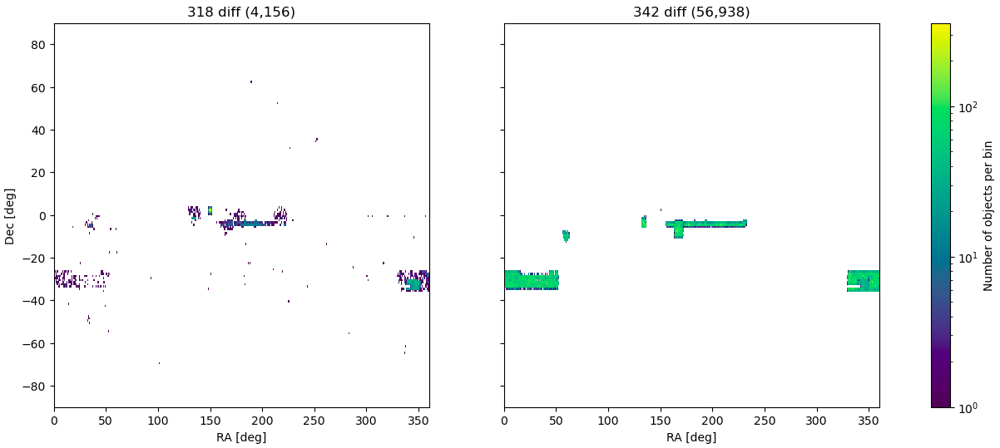

# Incident report: duplicated `CRD_ID` generation and leakage into the clean product

## Incident timeline

- issue identified: 2026-07-01
- correction finalized: 2026-07-06

## Scope

This report summarizes:

- the original failure mode observed in the pipeline;
- the most plausible code path that generated duplicated `CRD_ID` values;
- why stars could leak into the clean product;
- the correction that was applied;
- the observed impact when comparing a pre-fix clean product (`318`) against a post-fix clean product (`342`).

The goal is to document both the software issue and the likely scientific impact.

## Executive summary

The original issue was not a problem in the star-selection rule itself. The core problem was unstable distributed generation of `CRD_ID` values before the relevant dataframe state had been frozen. In large distributed runs, this could allow the same `CRD_ID` range to be reassigned to different rows.

Once that happened, identity semantics were broken:

- different objects could share the same `CRD_ID`;
- the deduplication graph could merge or label them inconsistently;
- a row with stellar semantics (`z_flag_homogenized = 6`) could coexist with a non-stellar row under the same logical identity;
- as a consequence, stars could appear to "leak" into a clean product where they should have been excluded.

The fix stabilized the dataframe before partition-size measurement, generated `CRD_ID` values from that stabilized state, and added explicit uniqueness validation.

When comparing the old and new clean products, the impact appears small in global percentage terms and concentrated at low redshift. The comparison did not indicate losses above `z > 1`, which is the most sensitive regime scientifically.

## Original symptom

The pipeline was run in a mode where:

- stars should receive `tie_result = 3`;
- stars should not survive into the final clean product in `concatenate_and_remove_duplicates`;
- clean survivors should instead be the non-stellar winners or hard ties, depending on the configured policy.

However, the output contained rows with:

- `z_flag_homogenized = 6`;
- `tie_result = 1`;
- presence in the clean output.

That combination is inconsistent with the intended semantics.

Further inspection showed cases where the same `CRD_ID` appeared more than once with conflicting attributes, including different:

- coordinates;
- redshifts;
- `z_flag_homogenized` values.

This indicates an identity-level problem rather than a simple mistake in tie labeling.

## Why stars could leak into the clean product

Under normal conditions, a given `CRD_ID` should correspond to one object. If that invariant holds, then a stellar object (`z_flag_homogenized = 6`) should remain semantically stellar throughout the deduplication logic and should not survive into the clean product.

The leakage became possible because duplicated `CRD_ID` values broke that invariant. Once different rows shared the same `CRD_ID`, the pipeline could no longer rely on `CRD_ID` as a clean identity key. That opened the door to inconsistent grouping, labeling, and consolidation.

In practical terms, a stellar row and a non-stellar row could be treated as if they belonged to the same logical identity, or could survive different labeling paths and then be merged or consolidated incorrectly.

## Most plausible software cause

The most plausible source of the duplicated `CRD_ID` values was the distributed ID generator in [packages/specz.py](/home/luigi/linea/pzserver_combine_redshift_dedup/packages/specz.py:1893).

The generator works by:

1. measuring the number of rows in each Dask partition;
2. computing cumulative offsets;
3. assigning IDs of the form `CRD<prefix>_<offset + local_index>`.

The key risk is that this procedure is only safe if the partition contents are stable between:

1. the moment partition sizes are measured; and
2. the moment IDs are actually assigned.

If the upstream Dask graph is re-executed non-deterministically between those two steps, the same ID interval can be reused for different rows.

That is the exact failure mode documented in the code comment now present in `_generate_crd_ids`:

> "Otherwise a second execution of a non-deterministic upstream graph can reuse an ID range for different rows."

This explains why the problem was much more likely to appear in large cluster runs:

- more partitions;
- more workers;
- more opportunities for recomputation;
- more scheduler and worker pressure;
- more reshuffling or re-materialization of upstream state.

In small runs, the bug could remain latent because the graph happened to re-execute in an effectively stable way.

## Corrective action

The fix was applied directly in the `CRD_ID` generation path:

- the dataframe is now persisted before partition sizes are measured;
- when a distributed client is available, the code waits for that persisted state;
- offsets are computed only from the stabilized dataframe;
- `CRD_ID` values are generated from that stabilized partition layout;
- uniqueness is explicitly validated afterward by `_validate_unique_crd_ids`.

Relevant code:

- [packages/specz.py](/home/luigi/linea/pzserver_combine_redshift_dedup/packages/specz.py:1893)
- [packages/specz.py](/home/luigi/linea/pzserver_combine_redshift_dedup/packages/specz.py:1950)

In addition, later work in the deduplication path strengthened:

- canonical `group_id` assignment;
- boundary-component consistency between main and margin;
- tie-result invariant checks;
- global diagnostics for invalid states.

Those changes reduce the chance that a future identity or grouping inconsistency could survive silently.

## Why the issue appeared mainly at large scale

The bug was almost certainly latent before it was observed at cluster scale.

Large runs make it easier for this kind of defect to manifest because they increase:

- the number of partitions;
- the depth and width of the distributed graph;
- memory pressure;
- task recomputation after worker loss or scheduling decisions;
- the chance that two evaluations of the same upstream graph are not operationally identical.

Therefore, the most likely interpretation is:

- the defect already existed;
- small or local runs often got lucky;
- large cluster runs exposed it.

## Product comparison: pre-fix `318` vs post-fix `342`

Two clean products were compared through spatial crossmatching:

- product `318`: clean output generated before the fix;
- product `342`: clean output generated after the fix.

The comparison extracted the objects that were not matched spatially between the two products, i.e.:

- objects present in `318` but not in `342`;
- objects present in `342` but not in `318`.

### Total sizes

- `318`: `6,616,173` rows
- `342`: `6,668,608` rows

### Unmatched counts

- `318`-only: `4,156`
- `342`-only: `56,938`

### Relative fractions

- `318`-only fraction: `4,156 / 6,616,173 ~= 0.0628%`
- `342`-only fraction: `56,938 / 6,668,608 ~= 0.8538%`

These are small fractions in global terms. The asymmetry also shows that the fix did not merely remove problematic rows; it also recovered a larger population of valid rows in the post-fix product.

## Observed properties of the differences

### Redshift distribution

The unmatched populations are concentrated at low redshift. The comparison did not indicate losses above `z > 1`.

This matters because the scientifically more sensitive regime is `z > 1`, where the reference spectroscopic surveys are sparser and each loss would have a larger relative impact.

In that sense, the comparison is reassuring: the disagreement between the old and new clean products appears concentrated in a regime that is less sensitive for the intended use.

### Flag distribution

The unmatched populations are dominated by high-quality homogenized flags, especially:

- `z_flag_homogenized = 4`;
- to a lesser extent, `z_flag_homogenized = 3`.

This is consistent with the fix affecting real clean-output membership rather than simply introducing random noise.

### Instrument type

The unmatched populations are dominated by:

- `instrument_type_homogenized = s`

This indicates that the effect is largely in the spectroscopic population.

### Sky distribution

The unmatched objects are not uniformly distributed across the sky. They are concentrated in specific observed regions and footprints, which is more consistent with a localized distributed-processing effect than with a uniform global scientific shift.

## Figures

### Redshift histogram of unmatched objects

### `z_flag_homogenized` distribution of unmatched objects

### `instrument_type_homogenized` distribution of unmatched objects

### Sky distribution of unmatched objects

## Scientific interpretation

The bug is real and it affects object identity, so it cannot be treated as purely operational. In principle, any identity collision can affect:

- completeness;
- purity;
- local group labeling;
- the presence or absence of rows in the clean product.

However, the empirical comparison between products `318` and `342` suggests that the overall impact was small in percentage terms:

- less than `1%` disagreement in either direction;
- much smaller on the `318`-only side;
- concentrated at low redshift;
- no apparent losses above `z > 1`.

Therefore, the most defensible conclusion is:

- the old product was not formally clean with respect to this bug;
- the new product is more correct and should be preferred;
- the observed differences do not suggest a large global scientific degradation in the old product;
- the old product likely remains usable for many purposes, with the caveat that the new product has better identity consistency and more reliable clean-selection semantics.

## Recommended wording

If a short technical statement is needed:

> The original issue was caused by unstable distributed generation of `CRD_ID` values before the partitioned dataframe had been frozen. In large runs, that could reuse the same ID range for different rows, breaking object identity and allowing inconsistent clean-product behavior, including stellar leakage. The fix stabilized the dataframe before offset computation and added explicit uniqueness checks. A direct comparison between the old and new clean products shows small global differences, concentrated at low redshift and with no apparent impact above `z > 1`, so the old product does not appear catastrophically compromised, although the new product is more reliable.

## Status of this report

This report is stored under:

- [docs/incidents/2026-07-01-crd-id-duplication.md](/home/luigi/linea/pzserver_combine_redshift_dedup/docs/incidents/2026-07-01-crd-id-duplication.md)
